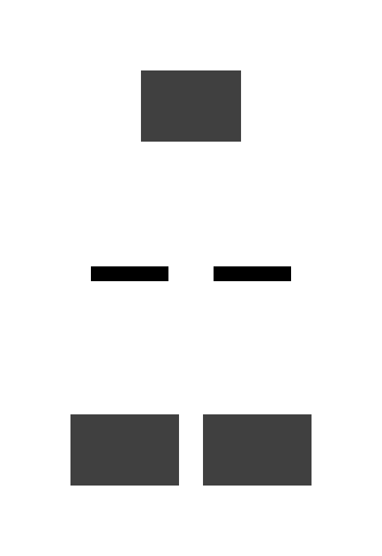
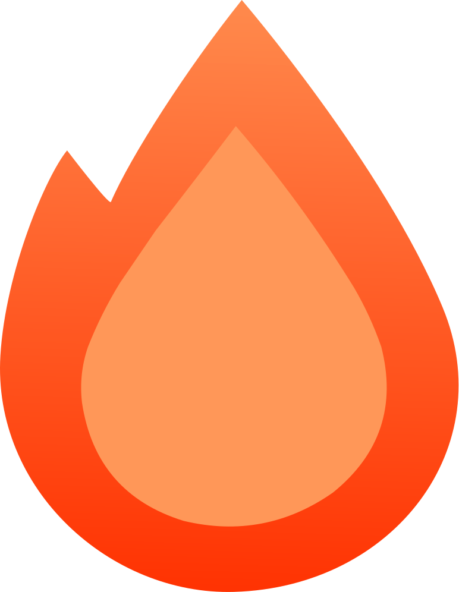
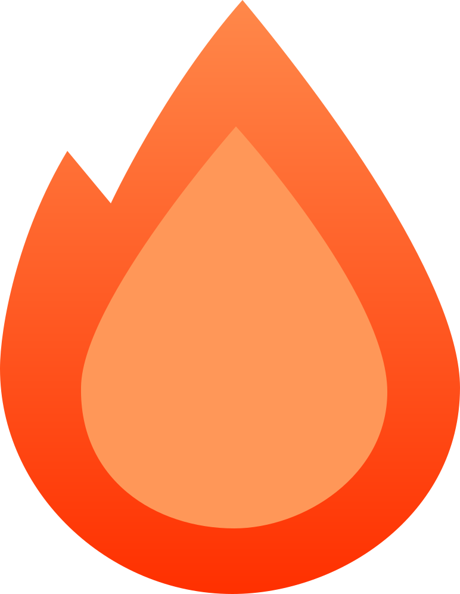
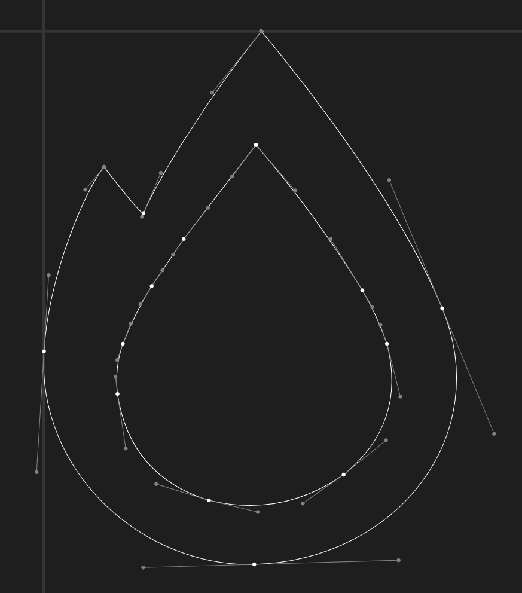
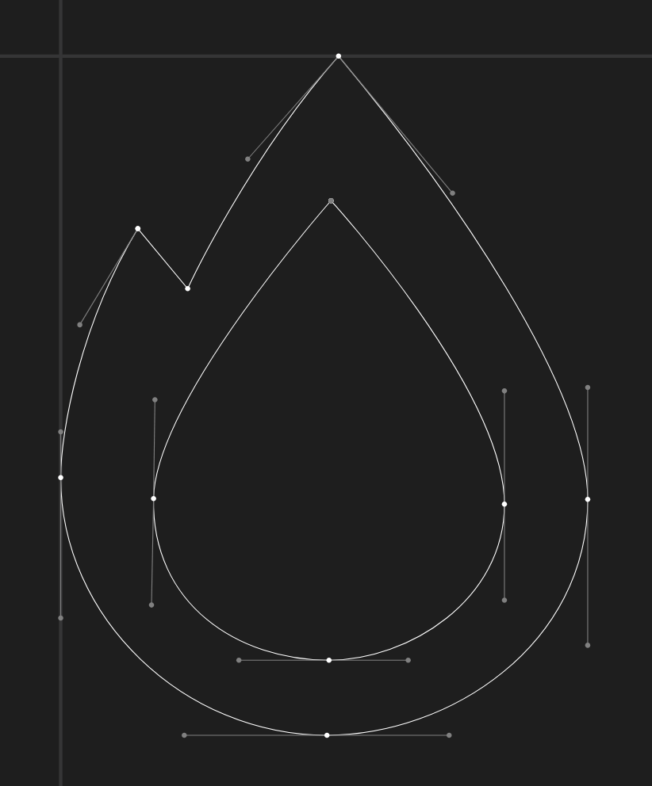
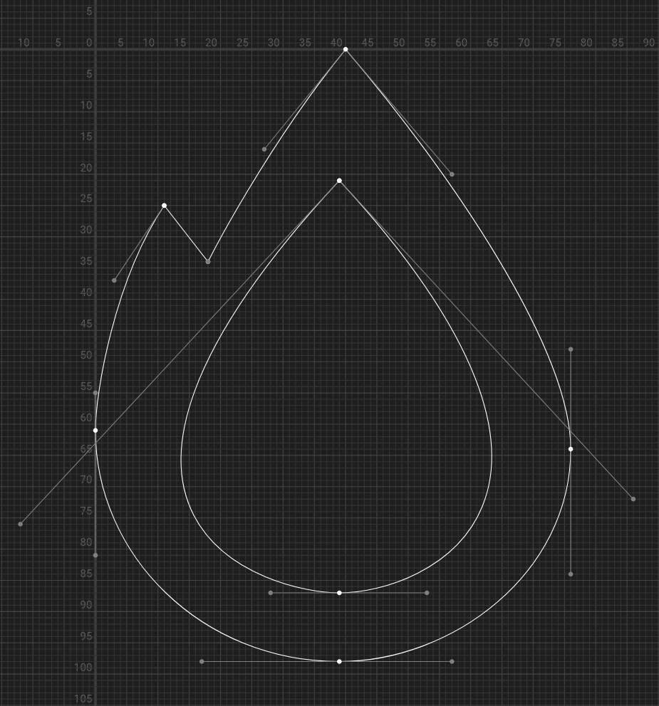
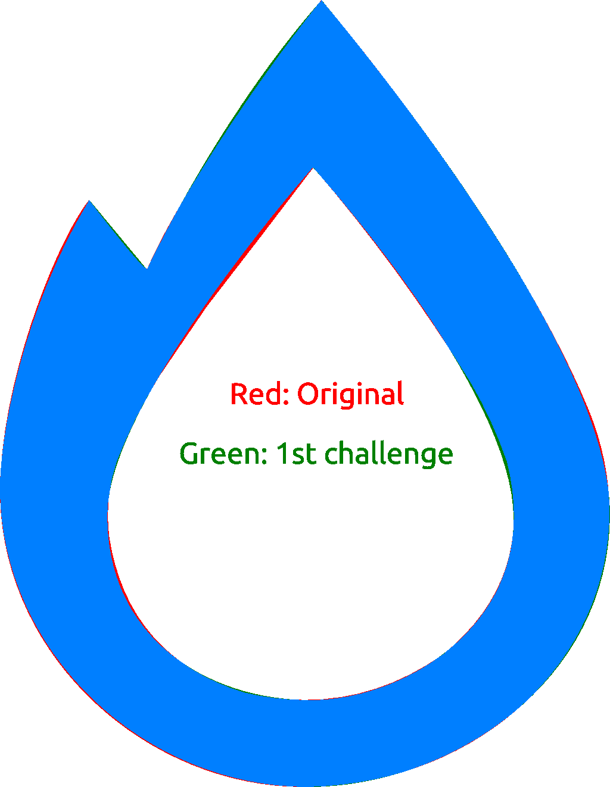
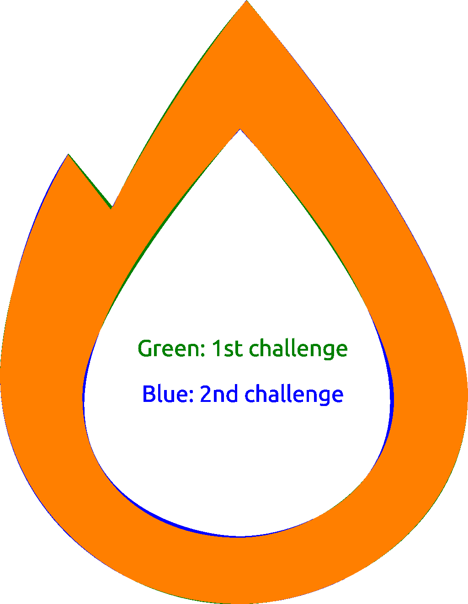
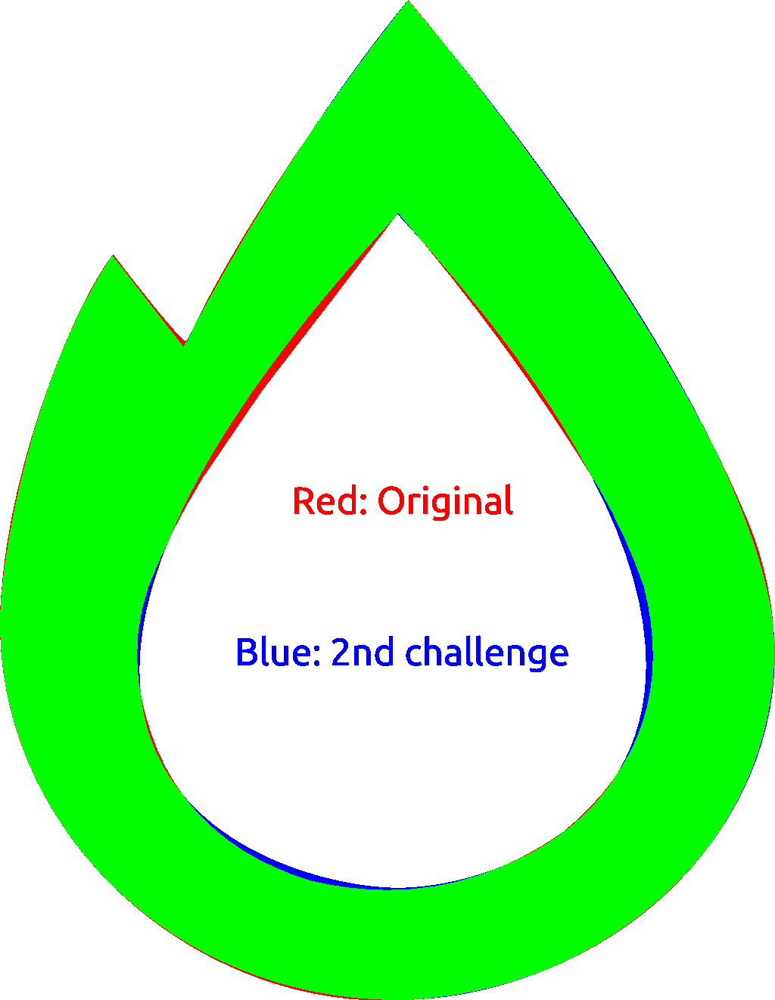

# Optimizing the Hono SVG Logo

I tried reducing the SVG file size just for fun!

Source: <https://github.com/honojs/website/issues/574>

Results:



## 1st Challenge

Use the same grid size as the original to achieve faithful results.

1. **Trace the Artwork**

   Import the original artwork and trace it using the pen tool in [Affinity Designer 2](https://affinity.serif.com/designer/).

   - Use fewer points for shaping: reduce from **45** to **25**.
   - **Result:** 1329 bytes

2. **Manual Tweaking**

   Tweak the exported SVG manually:

   - Round coordinate values from floating-point numbers to integers.
   - Simplify the `<linearGradient>` definitions.
   - Remove unnecessary tags such as `<?xml>`, `<!DOCTYPE>`, and `<g>`.
   - **Result:** 647 bytes

3. **Optimization with SVGOMG**

   Optimize the SVG using [SVGOMG](https://jakearchibald.github.io/svgomg/).

   - Remove unnecessary attributes like `width`, `height`, and `id`.
   - Convert coordinate values from absolute to relative.
   - **Result:** 507 bytes

   ```xml
   <svg xmlns="http://www.w3.org/2000/svg" viewBox="0 0 772 996">
     <path fill="url(#a)" d="m113 253 73 88S274 151 407 0c167 201 365 486 365 650 0 214-203 346-382 346C181 996 0 824 0 618c0-67 28-224 113-365Z"/>
     <path fill="#FF9758" d="M396 212S138 504 136 649c-3 156 125 237 257 237 116 0 257-88 257-229 0-166-254-445-254-445Z"/>
     <defs>
       <linearGradient id="a" x2="0%" y2="100%">
         <stop stop-color="#FF884A"/>
         <stop offset="100%" stop-color="#FF3000"/>
       </linearGradient>
     </defs>
   </svg>
   ```

## 2nd Challenge

Use a smaller grid size to reduce the maximum number of digits in the coordinate values from **3** to **2**.

### Determining the New viewBox Size

- **Original viewBox size:** 772 × 996
- **Original viewBox ratio:** 0.775100401606426

Find a two-digit width and height pair that approximates the original ratio as closely as possible while keeping the values as high as possible.

- For a width of 99: 99 × 0.775100401606426 ≈ 76.73
- For a width of 98: 98 × 0.775100401606426 ≈ 75.96 **(Chosen)**
- For a width of 97: 97 × 0.775100401606426 ≈ 75.18
- For a width of 96: 96 × 0.775100401606426 ≈ 74.41
- For a width of 95: 95 × 0.775100401606426 ≈ 73.63

- **New viewBox size:** 76 × 98
- **New viewBox ratio:** 0.775510204081633

### Re-processing the Artwork

1. **Trace the Artwork**

   Import the original artwork and trace it using the pen tool in [Affinity Designer 2](https://affinity.serif.com/designer/).

   - Use fewer points for shaping: reduce from **25** to **21**.
   - **Result:** 1257 bytes

2. **Manual Tweaking**

   Tweak the exported SVG manually:

   - Round coordinate values from floating-point numbers to integers.
   - Simplify the `<linearGradient>` definitions.
   - Remove unnecessary tags such as `<?xml>`, `<!DOCTYPE>`, and `<g>`.
   - Streamline the color representation:
     - Convert the format RGB to HEX
     - Shorten HEX digits from 6 to 3 (with slight adjustments):
       - `#FF9758` → `#F95`
       - `#FF884A` → `#F84`
       - `#FF3000` → `#F30`
   - **Result:** 432 bytes

3. **Optimization with SVGOMG**

   Optimize the SVG using [SVGOMG](https://jakearchibald.github.io/svgomg/).

   - Convert coordinate values from absolute to relative.
   - **Result:** 418 bytes

   ```xml
   <svg xmlns="http://www.w3.org/2000/svg" viewBox="0 0 76 98">
     <path fill="url(#a)" d="m11 25 7 9s9-18 22-34c17 20 36 48 36 64 0 20-19 34-37 34C17 98 0 81 0 61c0-6 3-24 11-36Z"/>
     <path fill="#F95" d="M39 21c47 51 14 66 0 66-11 0-51-11 0-66Z"/>
     <defs>
       <linearGradient id="a" x2="0%" y2="100%">
         <stop stop-color="#F84"/>
         <stop offset="100%" stop-color="#F30"/>
       </linearGradient>
     </defs>
   </svg>
   ```

## Comparing the Results

### Final Images

- **Original (1740 bytes):**

  

- **1st Challenge (507 bytes):**

  

- **2nd Challenge (418 bytes):**

  

### Path details

- **Original (Anchor points: 15, Control points: 30):**

  

- **1st Challenge (Anchor points: 10, Control points: 15):**

  

- **2nd Challenge (Anchor points: 8, Control points: 13):**

  

### Shape Differences

- **Difference between Original and 1st Challenge:**

  

- **Difference between 1st and 2nd Challenge:**

  

- **Difference between Original and 2nd Challenge:**

  
